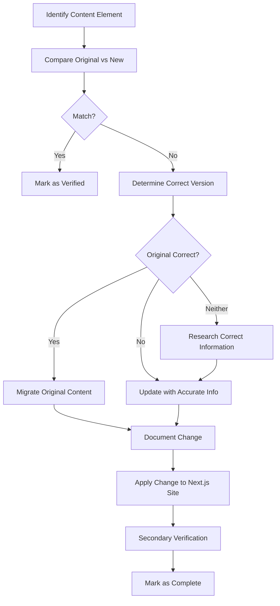

# Jason Holt Photography Content Migration & Verification Guide

This guide provides a structured approach for migrating content from the original HTML/CSS/JS site to the Next.js implementation, with a focus on accuracy, quality, and consistency. It addresses potential misinformation and establishes a robust verification process.

## Table of Contents

1. [Content Audit Process](#content-audit-process)
2. [Content Verification Framework](#content-verification-framework)
3. [Critical Business Information Checklist](#critical-business-information-checklist)
4. [Content Migration Workflow](#content-migration-workflow)
5. [Quality Assurance Process](#quality-assurance-process)
6. [SEO Considerations During Migration](#seo-considerations-during-migration)
7. [Documentation & Tracking](#documentation--tracking)

## Content Audit Process

### Step 1: Inventory Creation

Create a comprehensive inventory of all content from both the original and new sites:

```
Content Inventory Template:

[Page Name]
  ├── [Section Name]
  │   ├── Original Site Content: [Copy text/Describe element]
  │   ├── Next.js Site Content: [Copy text/Describe element]
  │   ├── Status: [Match/Mismatch/Missing/New]
  │   ├── Verification Required: [Yes/No]
  │   └── Notes: [Any discrepancies or special handling required]
  │
  ├── [Section Name]
  ...
```

Example:

```
Services Page
  ├── Portrait Photography Package
  │   ├── Original Site Content: "Portrait sessions start at €200 for a 1-hour session..."
  │   ├── Next.js Site Content: "Portrait sessions start at €250 for a 1-hour session..."
  │   ├── Status: Mismatch
  │   ├── Verification Required: Yes
  │   └── Notes: Price discrepancy - confirm current pricing
  │
  ├── Event Photography Package
  ...
```

### Step 2: Content Categorization

Categorize all content elements by priority and verification needs:

| Priority Level | Definition | Examples |
|----------------|------------|----------|
| Critical | Direct business impact | Pricing, services offered, contact information |
| High | Important for user decisions | Service descriptions, booking process, testimonials |
| Medium | Enhances user experience | About page content, image captions, blog posts |
| Low | Supplementary information | FAQ items, footer links, social media links |

### Step 3: Gap Analysis

Identify missing content and content that needs to be created for the new site:

- Content present in original site but missing from Next.js site
- New sections in Next.js site requiring fresh content
- Legacy content that should be retired
- Content that needs updating due to business changes

## Content Verification Framework

### Verification Workflow



### Verification Checklist

For each content element, verify:

- [ ] Factual accuracy
- [ ] Pricing correctness
- [ ] Service description accuracy
- [ ] Contact information validity
- [ ] Consistency with business offerings
- [ ] Up-to-date information
- [ ] Grammatical correctness
- [ ] Brand voice consistency
- [ ] Appropriate tone for target audience

### Verification Documentation

Document the verification process for each content element:

```
Verification Record:

Element ID: [Page-Section-Element]
Verified By: [Name]
Verification Date: [Date]
Original Content: [Text]
Verified Content: [Text]
Changes Made: [Description]
Source of Truth: [Business document/Owner confirmation/etc.]
```

## Critical Business Information Checklist

### Service Offerings & Pricing

- [ ] Portrait Photography packages and pricing
- [ ] Family Photography packages and pricing
- [ ] Event Photography packages and pricing
- [ ] Engagement/Couples Photography packages and pricing
- [ ] Senior Photography packages and pricing
- [ ] Special offers and promotions
- [ ] Package inclusions (number of images, delivery format, etc.)
- [ ] Add-on options and pricing

### Booking Process Information

- [ ] Booking steps accuracy
- [ ] Required information for booking
- [ ] Deposit requirements
- [ ] Cancellation policy
- [ ] Rescheduling policy
- [ ] Turnaround time expectations
- [ ] Delivery process

### Contact & Business Information

- [ ] Studio address (if applicable)
- [ ] Email address
- [ ] Phone number
- [ ] Business hours
- [ ] Service area (Frankfurt region)
- [ ] Response time expectations
- [ ] Social media links

### Legal Information

- [ ] Terms of service accuracy
- [ ] Privacy policy compliance with GDPR
- [ ] Model release information
- [ ] Copyright and usage rights
- [ ] Payment terms

## Content Migration Workflow

### Phase 1: Critical Business Information

1. Extract all critical information from original site
2. Verify accuracy with business owner
3. Update Next.js implementation with verified information
4. Document all changes in the verification log

### Phase 2: Customer-Facing Content

1. Migrate and verify all service descriptions
2. Update testimonials ensuring they represent actual clients
3. Verify about page content and photographer bio
4. Update process descriptions and what-to-expect content

### Phase 3: Supporting Content

1. Migrate and update FAQ content
2. Create or update blog content strategy
3. Add location-specific information for Frankfurt area
4. Implement seasonal or special offer content

### Phase 4: SEO & Metadata

1. Extract and improve meta titles and descriptions
2. Update alt text for all images
3. Create structured data for key pages
4. Implement OpenGraph and social sharing metadata

## Quality Assurance Process

### Technical QA

For each page after content migration:

- [ ] Check for broken links
- [ ] Verify form functionality
- [ ] Test responsive behavior across devices
- [ ] Confirm image loading and display
- [ ] Validate HTML/CSS rendering

### Content QA

For each page after content migration:

- [ ] Proofread for spelling and grammar
- [ ] Check formatting consistency
- [ ] Verify tone and brand voice
- [ ] Ensure accessibility of content
- [ ] Test readability across different devices

### User Journey QA

Test complete user journeys through the site:

- [ ] Homepage to service selection
- [ ] Service page to booking flow
- [ ] Gallery browsing experience
- [ ] Contact process
- [ ] Mobile booking experience

## SEO Considerations During Migration

### Content-Based SEO Elements

When migrating content, preserve and enhance:

- **Keyword Integration**: Maintain important keywords while improving natural language usage
- **Content Structure**: Use proper heading hierarchy (H1, H2, H3, etc.)
- **Internal Linking**: Preserve existing internal links and improve where possible
- **Content Depth**: Ensure service pages have substantive, valuable content

### Technical SEO Elements

Add during the migration process:

- **Structured Data**: Implement appropriate schema markup (LocalBusiness, ImageGallery, etc.)
- **Canonical Tags**: Set canonical URLs for all pages
- **XML Sitemap**: Generate comprehensive sitemap
- **Meta Tags**: Create optimized title tags and meta descriptions
- **Image Optimization**: Add descriptive alt text and filenames

### URL Structure & Redirects

- Map old URLs to new Next.js routes
- Implement 301 redirects for changed URLs
- Preserve URL structure where possible for SEO value retention

## Documentation & Tracking

### Content Migration Tracker

Create a master tracking document:

```
Content Migration Status:

[Page Name]
  ├── Audit Complete: [Yes/No]
  ├── Verification Complete: [Yes/No]
  ├── Migration Complete: [Yes/No]
  ├── QA Complete: [Yes/No]
  ├── SEO Elements Implemented: [Yes/No]
  ├── Approved by Owner: [Yes/No]
  ├── Last Updated: [Date]
  └── Outstanding Issues: [List any]
```

### Final Verification

Before site launch:

1. Complete site walkthrough with business owner
2. Document final approvals for all content
3. Create a content update schedule for post-launch maintenance
4. Establish process for ongoing content accuracy

## Appendix: Content Inventory Template

A detailed content inventory template is available as a spreadsheet at:
`/jhp-next/docs/templates/content-inventory-template.xlsx`

This template includes:
- Full page-by-page content comparison
- Status tracking fields
- Verification timestamps
- Migration notes
- QA checklist integration

## Conclusion

Following this structured approach to content migration ensures that the new Next.js implementation accurately represents the Jason Holt Photography business, eliminates any misinformation, and presents a cohesive, professional online presence that converts visitors into clients.
