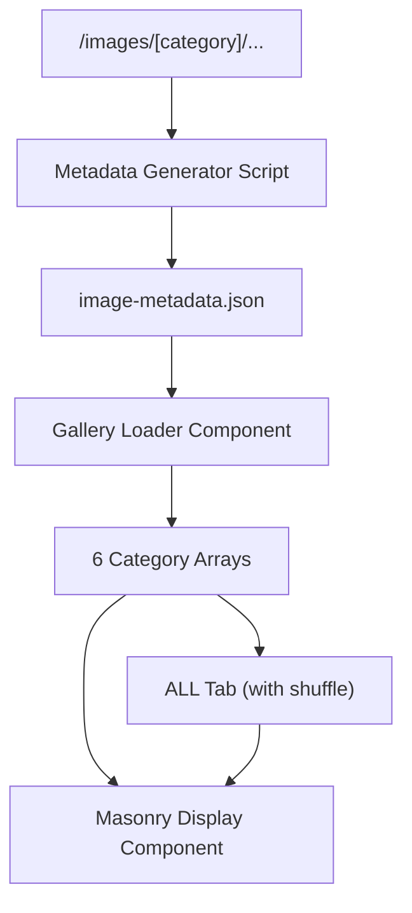

# Elegant Gallery System - Implementation Plan

## Key Principles

1. **Directory-Based Categories**: Images live in folders matching their category names
2. **One Loading Process**: A single function loads all images at once
3. **Simple Metadata**: Easy-to-extend JSON for additional image information
4. **Clean Shuffling**: One standard Fisher-Yates shuffle for the ALL tab

## System Architecture



## Implementation Steps

1. Simplify the gallery loading process in `app/galleries/page.tsx`
2. Clean up the metadata handling in the masonry grid component
3. Update utilities to ensure consistent path handling
4. Remove complex code and redundant functionality

## Directory Structure

```
/images/
  /portraits/...
  /headshots/...
  /family/...
  /events/...
  /engagements/...
  /weddings/...
```

## Easy Image Addition Process

1. **Add Image Files**
   - Drop new image into appropriate category folder

2. **Generate Metadata** (can be automated)
   - Run `npm run generate-metadata`

3. **Done!**
   - No code changes needed for new images
