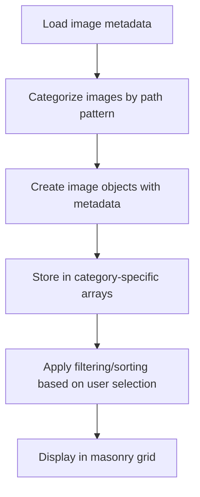

# Gallery System Guide

This document explains the elegant and simple approach used in the photo gallery system.

## Overview

The gallery system follows a straightforward approach:

1. Images live in category directories (`/images/[category]/...`)
2. Metadata is generated from the image files
3. The gallery component loads and displays images based on category selection
4. The ALL tab combines and shuffles images from all categories

## Key Components

### 1. Gallery Page Component (`app/galleries/page.tsx`)

This is the main component that:
- Loads image metadata
- Organizes images into categories
- Provides filtering and sorting
- Handles the display and lightbox functionality

### 2. Masonry Grid Component (`components/ui/masonry-grid.tsx`)

This component handles the display of images in a masonry layout:
- Calculates optimal positioning for different screen sizes
- Handles image loading and lazy loading for performance
- Manages aspect ratios for different image types

## How It Works

### Image Loading Process



### Path-Based Categorization

Images are categorized based on their file path:

```javascript
if (imagePath.match(/\/(optimized\/)?portraits\//i)) category = 'portraits';
else if (imagePath.match(/\/(optimized\/)?headshots\//i)) category = 'headshots';
// etc...
```

This makes it easy to add new images - just place them in the correct directory.

### The ALL Tab and Shuffling

For the ALL tab, we:
1. Combine all category arrays into a single array
2. Apply a Fisher-Yates shuffle for true randomness:

```javascript
function shuffleArray(array) {
  const shuffled = [...array];
  for (let i = shuffled.length - 1; i > 0; i--) {
    const j = Math.floor(Math.random() * (i + 1));
    [shuffled[i], shuffled[j]] = [shuffled[j], shuffled[i]];
  }
  return shuffled;
}
```

### Sorting Options

Several sorting options are available:
- **Newest**: Sort by date, newest first
- **Oldest**: Sort by date, oldest first
- **A-Z**: Sort alphabetically by alt text
- **Z-A**: Sort alphabetically in reverse
- **Random**: Apply shuffling

## Adding New Images

1. **Add image files** to the appropriate category directory:
   - `/images/portraits/`
   - `/images/headshots/`
   - `/images/family/`
   - `/images/events/`
   - `/images/engagements/`
   - `/images/weddings/`

2. **Regenerate metadata**:
   ```bash
   npm run generate-image-metadata
   ```

3. That's it! The system automatically detects new images based on their directory location.

## Aspect Ratio Handling

The system handles image aspect ratios through:

1. **Metadata File**: Precomputed aspect ratios are stored in the metadata
2. **Category Fallbacks**: If metadata isn't available, category-specific defaults are used:
   ```javascript
   const DEFAULT_ASPECT_RATIOS = {
     'portraits': 0.8,  // Portrait orientation (taller than wide)
     'headshots': 1.0,  // Square aspect ratio
     'family': 1.5,     // Landscape orientation (wider than tall)
     'engagements': 1.5,
     'events': 1.5,
     'weddings': 1.5,
     'default': 1.5
   };
   ```

## Performance Optimizations

1. **Lazy Loading**: Only the first 50 images are initially rendered
2. **Priority Loading**: The first 10 images are marked as high priority
3. **Infinite Scroll**: Additional images load as the user scrolls
4. **Cached Metadata**: Image dimensions and aspect ratios are cached
5. **Selective Re-rendering**: Components only re-render when necessary

## Debugging

If something isn't working as expected:

1. Check the browser console for logs - the system provides detailed information about:
   - Metadata loading
   - Image categorization
   - Shuffling process
   - Display operations

2. Verify that image metadata has been generated:
   ```bash
   cat public/image-metadata.json | grep your-image-name
   ```

3. Check that images are in the correct directories
