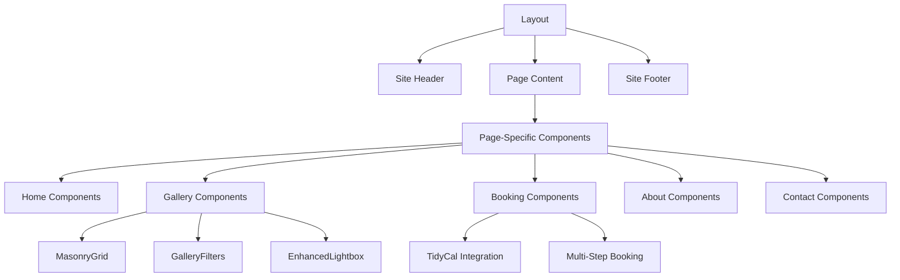
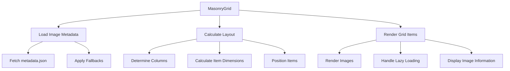
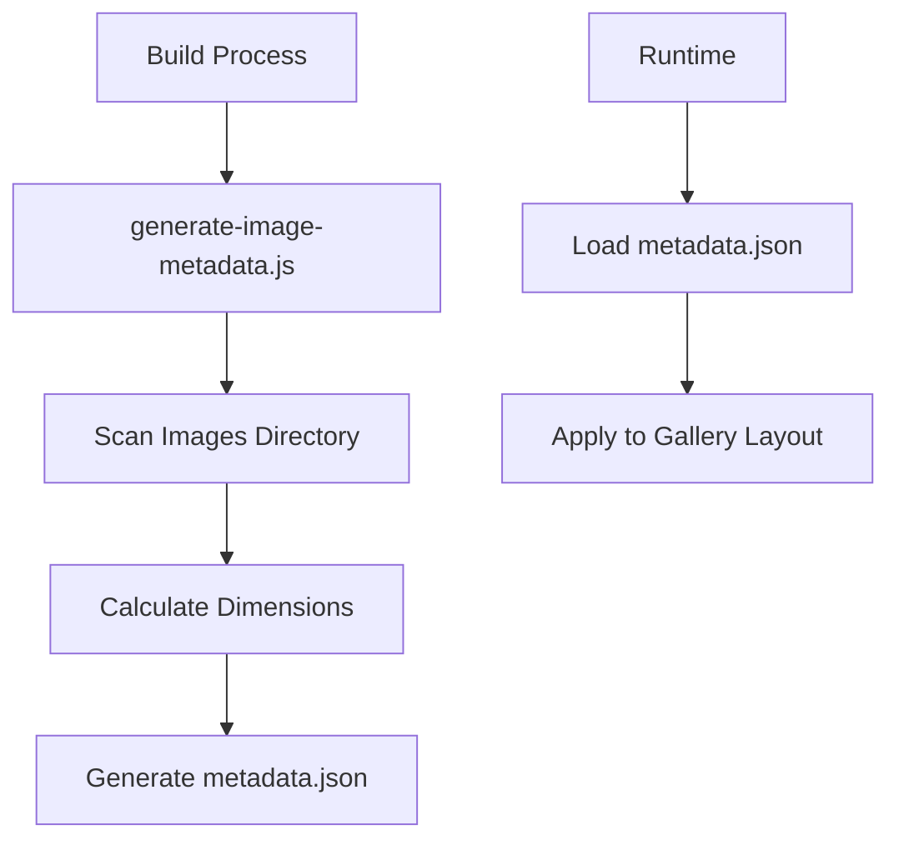
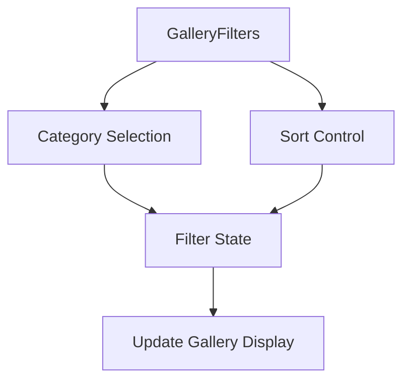
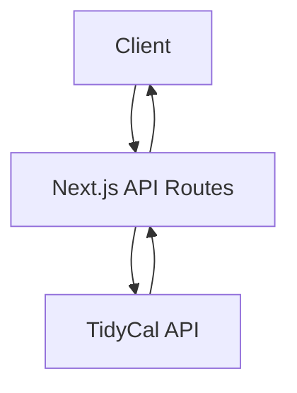

# Jason Holt Photography System Patterns

## Architecture Overview

The Jason Holt Photography website is built on a modern web stack with the following key technologies:

- **Framework:** Next.js 14 with TypeScript
- **Styling:** Tailwind CSS with custom theming
- **Components:** shadcn/ui component library
- **Integration:** TidyCal booking API
- **State Management:** React Hooks for local state management
- **Build Process:** Custom image metadata generation

The application follows a component-based architecture with clear separation of concerns and reusable UI elements.

## Component Structure



## Key Design Patterns

### 1. Component Composition

Components are built following a composition model, with smaller components combined to create more complex interfaces. For example:

```tsx
<MasonryGrid>
  <GalleryImage />
  <GalleryImage />
  ...
</MasonryGrid>
```

### 2. Container/Presentational Pattern

Pages act as containers that manage state and data flow, while UI components are primarily presentational:

- **Containers:** Pages like `gallery.tsx` that manage state, data fetching, and event handling
- **Presentational:** Components like `MasonryGrid.tsx` that receive props and render UI

### 3. Custom Hooks

Custom hooks encapsulate reusable logic:

- `useImageMetadata`: Manages loading and retrieving image aspect ratio information
- `useMobile`: Detects mobile devices for responsive behavior

### 4. Responsive Layout System

The site uses a combination of approaches for responsiveness:

- **Fluid Grid:** For overall layout using Tailwind's responsive utilities
- **Breakpoint-Based:** For component-specific behaviors (e.g., masonry grid columns)
- **Container Queries:** For components that need to adapt based on their container

## Gallery System Architecture

The gallery system is built around three key components:

### 1. MasonryGrid Component



Key patterns in the MasonryGrid:
- **Dynamic Layout Algorithm:** Items are placed in the shortest column first
- **Aspect Ratio Preservation:** Image heights calculated based on aspect ratios
- **Fallback System:** Category-based defaults when metadata is unavailable
- **Responsive Columns:** Automatically adjusts column count based on screen width

### 2. Image Metadata System



The metadata system follows a build-time generation / runtime consumption pattern:
- Images are analyzed during build
- Results are stored in a static JSON file
- The frontend loads this file dynamically
- Fallbacks ensure graceful behavior when metadata is missing

### 3. Gallery Filters



The filtering system uses:
- **Controlled Components:** UI elements tied to state
- **State Lifting:** State managed at the page level
- **Reactive Updates:** Gallery automatically updates when filters change

## API Integration Patterns

### TidyCal Booking



- **Server-Side Integration:** API calls to TidyCal are proxied through Next.js API routes
- **CORS Protection:** Avoids direct client-to-TidyCal calls that might be blocked
- **Error Handling:** Centralized error handling in API routes

## State Management

The application uses React's built-in state management capabilities:
- **useState:** For component-local state
- **useEffect:** For side effects like data fetching
- **useMemo/useCallback:** For performance optimization
- **Context API:** For theme management (light/dark mode)

## Performance Patterns

1. **Image Optimization:**
   - Next.js Image component for automatic optimization
   - Aspect ratio preservation to avoid layout shifts
   - Lazy loading for below-fold content

2. **Code Organization:**
   - Server components where appropriate
   - Client components only when interactivity is needed
   - Dynamic imports for code splitting

3. **Incremental Loading:**
   - Initial load shows limited images
   - "Load More" button progressively reveals content
   - Maintains performance on image-heavy pages

## Component Configuration

Components are designed with customization in mind:
- **Props for appearance:** Columns, gap, etc.
- **Callback props for behavior:** onImageClick, onCategoryChange
- **TypeScript interfaces:** Clear documentation of available options
